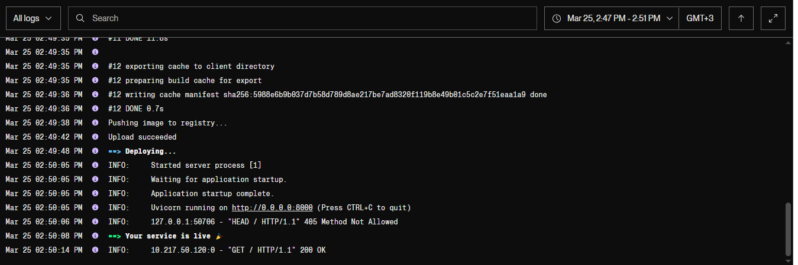

# Сервис для сокращения ссылок


API сервиса помогает сократить ссылки пользователям, предоставляет информацию по short codes, а также умеет удалять
ссылки, которые долго не были использованы.

------

Ссылка на сервис: [https://short-url-service.onrender.com](https://shorten-url-master.onrender.com/docs)

Render не поддерживает docker-compose, поэтому работа сервиса продемонстрирована в разделе
[Демонстрация](#Демонстрация)

-----

### Установка:

1. Установить все зависимости pip install -r requirements.txt
2. Запустить docker-compose up

-----

### Конфигурация

1. Версия Python 3.12
2. База данных: postgresql. Создаются три таблицы User, Link, LinkArchive для хранения информации по пользователям,
   линкам и удаленным линкам.
3. Распределенная система: Celery. Создается Celery-таска для удаления неиспользуемых ссылок.
4. База данных Redis для кэширования запросов.

------

## Инструкция

1. [API сервиса](#API-сервиса)
2. [Тесты API](#Тесты-API)

## API сервиса

1. Создание пользователя. Пароль хэшируется и в таком виде хранится в БД. Пользователю выдается access_token в cookie.\
   **Метод** `POST /auth/register`\
   Параметры:

```
{
  "username": "string",
  "email": "string",
  "password": "string"
}
```

Ответ:

```
{
  "access_token": "string",
  "token_type": "string"
}
```

2. Аутентификация пользователя. Верифицируется acess_token \
   **Метод** `POST /auth/login`\
   Параметры:

```
{
  "username": "string",
  "password": "string"
}
```

Ответ:

```
{
   message: "Hi again in the dark side, we have cookies"
}
```

3. Выход из системы. Логирование пользователя (удаление токена и завершение сессии).\
   **Метод** `POST /auth/logout`\

Ответ:

```
{
  "message": "Вы успешно вышли из системы"
}
```

4. Проверка информации пользователя.\
   **Метод** `GET /auth/me`

Если пользователь залогинен, то возвращается информация о пользователе.\
Ответ:

```
{
  "username": "string",
  "email": "string",
}
```

Если пользователь не залогинен, то возвращается ошибка.

```
{
detail: "Произошла ошибка"
status_code: 500
}
```

5. Сокращение ссылки. Если не будут предоставлены short_code и expires_at, то код будет сгенерирован автоматически и
   время жизни ссылки будет установлено полгода. \
   **Метод** `POST /links/shorten`\
   Параметры:

```
{
  "url": "string", (обязательное поле)
  "short_code": "string",
  "expires_at": "string",
}
```

Ответ:

```
{
  "short_code": "string",
  "original_url": "string"
}
```

6. Переход по сокращенной ссылке. Увеличивает счетчик кликов по ссылке\
   **Метод** `GET /links/{short_code}`\
   Параметры:

```
{
  "short_code": "string"
}
```

Ответ: Редирект на оригинальный URL

7. Удаление ссылки. Доступно только авторизованному пользователю.\
   **Метод** `DELETE /links/{short_code}`\
   Параметры:

```
{
  "short_code": "string"
}
```

Ответ: HTTP 204 No Content

8. Изменение шорт кода ссылки. Доступно только авторизованному пользователю.\
   **Метод** `PUT /links/{short_code}`\
   Параметры:

```
{
  "short_code": "string",
  "new_code": "string",
}
```

Ответ:

```
{
"message": "Ссылка обновлена"
}
```

9. Получение статистики для сокращенной ссылки.\
   **Метод** `GET /links/{short_code}/stats`\
   Параметры:

```
{
  "short_code": "string"
}
```

Ответ:

```
[
    {
        "original_url": "yandex.ru",
        "created_at": "2025-03-25 07:56:17.908659",
        "clicks": 1,
        "last_used_at": "None"
    }
]
```

10. Поиск ссылок по URL.\
    **Метод** `GET /links/search/{original_url}`\
    Параметры:

```
{
  "original_url": "string"
}
```

Ответ:

```
[
    {
        "short_code": "string",
        "original_url": "yandex.ru",
        "created_at": "2025-03-25 07:56:17.908659",
        "clicks": 1,
        "last_used_at": "None"
    }
]
```

11. Удаление неиспользуемых ссылок. Доступно только зарегистрированным пользователям. Метод настроен как таска celery,
    чтобы можно было настроить расписание. Таска перемещает неиспользуемые ссылки в архив.\
    **Метод** `POST /links/delete/{days}`\
    Параметры:

```
{
  "days": "int"
}
```   
   Ответ:

```
{
  "task_id": "string",
  "status": "task started"
}
```

12. Получение статуса выполнения задачи.\
    **Метод** `GET /links/task-status/{task_id}`\
    Параметры:

```
{
  "task_id": "string"
}
```
Ответ:

```
{
  "status": "SUCCESS"
}
```

13. Получение статистики архивных ссылок.\
    **Метод** `GET /links/history/`\
    Параметры:

Ответ:

```
[
    {
        "short_code": "ya",
        "original_url": "ya.ru",
        "deleted_at": "2025-03-25 11:45:24.681932+00:00",
        "reason": "Неиспользуемая ссылка"
    },
    {
        "short_code": "test1",
        "original_url": "ya.ru",
        "deleted_at": "2025-03-25 11:45:24.682126+00:00",
        "reason": "Неиспользуемая ссылка"
    },
    {
        "short_code": "test",
        "original_url": "ya.ru",
        "deleted_at": "2025-03-25 11:45:24.682170+00:00",
        "reason": "Неиспользуемая ссылка"
    }
]
```

## Демонстрация

1. Деплой на render.com


2. Деплой в docker


3. Показ работы